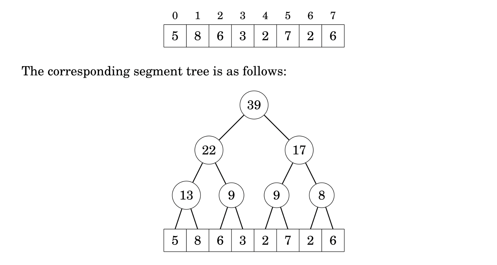
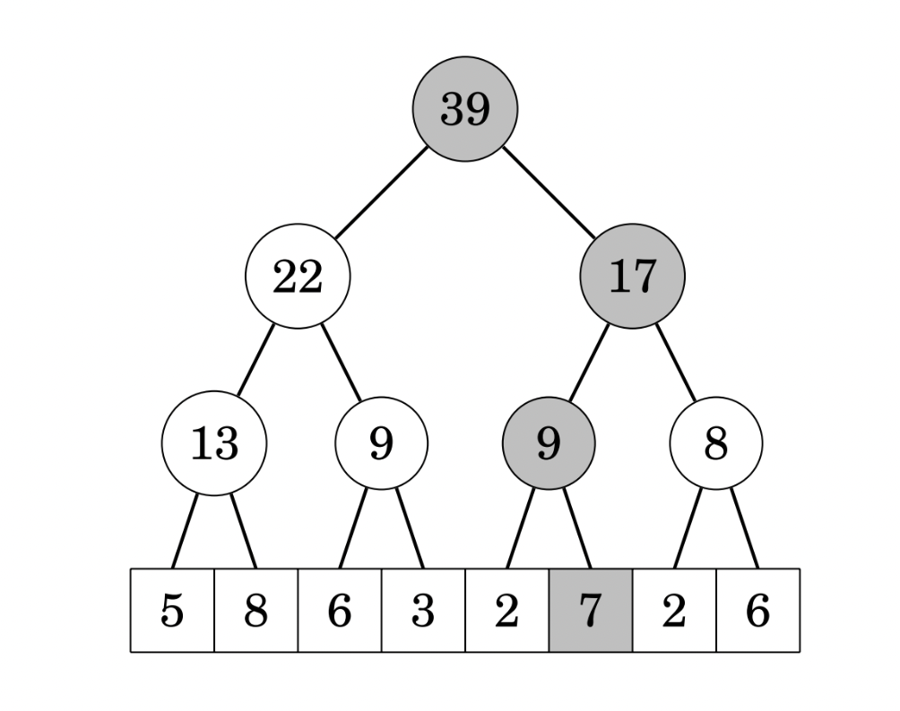
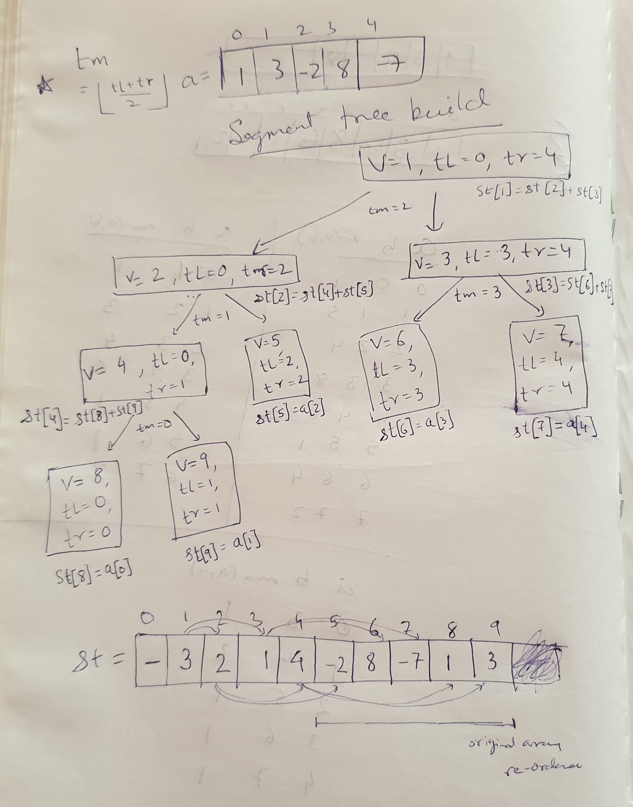

Also known as similar to `Interval tree`.

## Resources

https://cp-algorithms.com/data_structures/segment_tree.html
https://www.youtube.com/watch?v=2bSS8rtFym4
https://www.youtube.com/watch?v=ocEiY9dF-nM
https://www.youtube.com/watch?v=oOufBRAEnUA
https://www.youtube.com/watch?v=QvgpIX4_vyA
https://www.youtube.com/watch?v=Tr-xEGoByFQ
https://www.hackerearth.com/practice/data-structures/advanced-data-structures/segment-trees/tutorial/
https://codeforces.com/blog/entry/1256
https://codeforces.com/blog/entry/18051
https://www.cs.cmu.edu/~ckingsf/bioinfo-lectures/intervaltrees.pdf
https://www.topcoder.com/thrive/articles/Range%20Minimum%20Query%20and%20Lowest%20Common%20Ancestor

## Goal

All range query operation in O(log N) with dynamic updates supported also in O(log N)
Space requirements: O(N)

Other typical range queries:
1. Range Min Query: minimum value in range `[a,b]`
2. Range Sum Query: sum value in range `[a,b]`
3. Range Max Query: maximum value in range `[a,b]`


## Idea

Intermediate nodes for various intervals (to store metadata) to be used for range queries.

Each internal tree node corresponds to a array-range whose size is power of two.
`Fact` - any range `[a,b]` can be divided into `logN` ranges whose values are stoed in internal tree nodes.



`updates`: for updates, we should update all the interval aggregates that might be affected which would be atmost O(log N).


Think of mergesort like divide and conquer but using memory instead to store the halved range results.

## Array Representation

The tree is encoded as an array, **1-indexed**.
The smallest ranges are index themselves i.e. `[i,i]`
whenever n is not a power of two, not all levels of the Segment Tree will be completely filled.


This simplifies the implementation a lot. We don't need to store the structure of the tree in memory. It is defined implicitly. We only need one array which contains the sums of all segments.

`Storage allocation (1-indexed for eaiser left/right child calculations)`:
```cpp
int n, st[4*MAXN];// 4n is upper bound on number of total vertices, 1-indexed
```
The sum of the `root vertex at index 1`, 
the sums of its two child vertices at indices 2 and 3, 
the sums of the children of those two vertices at indices 4 to 7, and so on. 
It is easy to see, that the left child of a vertex at index `2*i` is stored at index `2*i + 1`, and the right one at index .

### Building segment tree - O(N)

It is convenient to describe this operation recursively in the other direction, i.e., from the root vertex to the leaf vertices. The construction procedure, if called on a non-leaf vertex, does the following:

1. recursively construct the values of the two child vertices
2. merge the computed values of these children

We start the construction at the root vertex, and hence, we are able to compute the entire segment tree

The time complexity of this construction is `O(N)`, 
assuming that the merge operation is constant time (the merge operation gets called  times, which is equal to the number of internal nodes in the segment tree).

`Given array a[]`,
recursive function build with parameters:
1. `a[]` - original array
2. `v` - index of the current vertex
3. left boundary - `tl` of current segment
4. right boundary - `tr` of current segment

Start with:
`v = 1` (one indexed st)
`tl = 0`
`tr = n - 1`

```cpp
// recursive build
void build(int a[], int v, int tl, int tr) {
    if (tl == tr) { // leaf node, termination condition
        st[v] = a[tl];
    } else { // non-leaf, build up recursively
        int tm = (tl + tr) / 2;
        build(a, 2*v, tl, tm);// build children first
        build(a, 2*v+1, tm+1, tr);// build children first
        st[v] = st[2*v] + st[2*v + 1];// gather data from children 
    }
}
// calling to setup
build(a, 1, 0, n-1);
```

given `a = [1,3,-2,8,-7]`
Array:
| 1 | 3 | -2 | 8 | -7 |
|---|---|----|---|----|


`st[]` = 
| - | 3 | 2 | 1 | 4 | -2 | 8 | -7 | 1 | 3 |
|---|---|---|---|---|----|---|----|---|---|

Here is the recursive build-up:



## Non-array representation (AlgorithmsThread 3)

```java
class SegmentTree {
    int leftmost, rightmost;
    int sum;
    SegmentTree leftChild, rightChild;
}
```

## merge function

intervals are merged together to form larger intervals, starting from `[i,i]`


## Interesting cases:

1. query interval totally covers calculated interval value
2. query interval totally disjoint from calculated interval value
3. query interval partially overlaps with a calculated interval value


## Queries

## Updates


