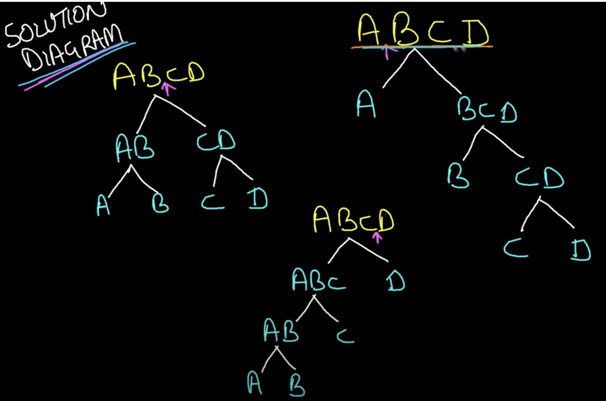

##

https://www.youtube.com/watch?v=XrB_MWPjHHc

https://www.youtube.com/watch?v=vRVfmbCFW7Y


## Goal

Minimize no. of multiplications needed for multiplying a chain of matrices
e.g. A x B x C x D x E


## General abstraction (Partition DP)

Recursive decomposition into partitions. (think of split/break as the last combine step)

You can think of this problem as breaking a chain into two parititons,
where the partition break is the last combine step that will happen.


### decomposition diagram

You can notice the repeating subproblems in the diagram.




### Recursive/memo formulation of MCM


## Cost of multiplying two matrices A and B

if A is of dimension `i x j`, and B is of dimension `j x k`,
then cost of multiplying A x B is `i x j x k`.

Proof: The size of final matrix is `i x k`. To calculate each value of final matrix, we need to do `j` multiplications (This is by matrix multiplication property).

## Multiplication order matters

Depending on the order of which matrix multiplication happens first, we would have more or less no of multiplications:
e.g. 
Let:
A: `4 x 2`
B: `2 x 3`
C: `3 x 1`
D: `1 x 3`

For ((AxB)xC)xD: 4x2x3 + 4x3x1 + 4x1x3 = 48

For (Ax(BxC))xD: 2x3x1 + 4x2x1 + 4x1x3 = 26

## Dp state

If you N matrices to multiply,
create a `dp[N][N]` table.

subproblem: If I have a answer for a smaller matrix chain e.g. i..j, 
i.e. `dp[i][j] = min mults needed to multiply all matrices from ith matrix to jth matrix, i <= j`

This is basically `DP on sub ranges` - **The base case is single elements on diagonal are trivial ranges `dp[i][i]`, and final answer is full range i.e. upper right corner of dp table dp[0][n]**

### Base cases are diagonal elements i.e. dp[i][i] represents ith matrix in chain

`dp[i][i] = 0`
No multiplications needed for the single matrix

### Dp table filling 

We will be filling upper right dp triangle
For dp to work, all entries to left and bottom of a given cell, have to be filled first.

For filling each item of cell, we refer to all entries to the left and bottom of that cell. -> This contributes extra O(N) per cell, thus leading to overall O(N^3) complexity

This table filling technique is useful when we want all left/bottom entries filled before we can calculate current cell.


### Recurrence

`given x<=y`,
`dp[x][y] = min(dp[x][k] + dp[k+1][y]) +dim(x*k+1*y+1) for all k in x..y-1`

For diagram shown above, as noticed fill bottom and left entries first, and calculate new values based on it.
```
for l = N to 0:     // for each row num starting from bottom to top
    for r = l to N: // for each column from left to right for given row
        for k in l..r: // for all k possible splits of l..r
            dp[l][r] = min_over_all_k(dp[l][k] + dp[k][r] + xyz)

            dp[l][k] <-- because r>k -- dp[l][r]
                                            |
                                        because k>l
                                            |
                                            v
                                        dp[k][r]
```

### final ans is dp[1][n]

## Variant

https://www.spoj.com/problems/MIXTURES/