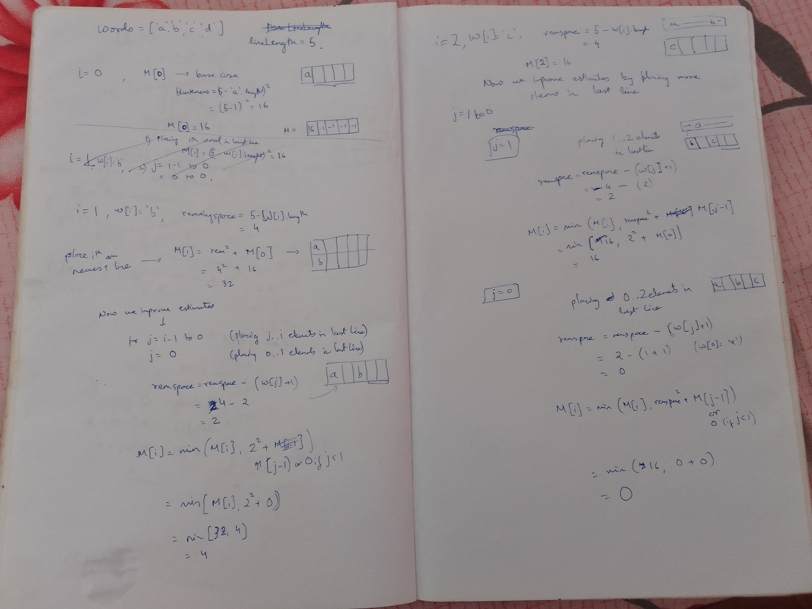

## Messiness of end-of-line whitespace

The messiness of single line ending with b blank charachters is b^2.
Total messiness of a sequence of lines is the sum of messiness of all the lines.

**Note** - no word is split across lines.

## Minimize messiness given an array of words


### Example: place `a, b, c, d`

e.g. messiness = 4 ^ 2 = 16.
| a | | b | | c |
|--- | --- | --- | --- | --- |
| d | | | | |

### Better placement of `a, b, c, d`

messiness = 2^2 + 2^2 = 8
| a | | b | | |
| --- | --- | --- | --- | --- |
| c | | d | | |

## Greedy strategy does not work

Seeing the example given above, greedy strategy is not good

## Core Idea

In optimum placement of i words,
the last line consists of some subset of words ending in ith word.
Try to place starting from ith word to as many as possible counting down from i-1 till you have some space remaining on last line, and improve estimates for `messiness[i]`.


## DP State

`M[i] = minimum messiness for placing first i words`

`f(i,j) = messiness of the last line having words i..j`

## DP recurrence

We will try to place as many words as possible in last line and update min estimate,

ith, i-1th word -> update min possiblle for i
ith, i-1th, i-2th word -> update min possiblle for i
... -> update min possiblle for i
ith, i-1th, i-2th, ... i-kth word -> update min possiblle for i

`M[i] = for j = i,i-1,i-2,...k where k is least possible index which can fit in last line, min(M[i], f(i,j) + M[j-1])`, we notice j-1th item sits on previous line.
`f(i,j) = blank^2 after placing words j..i on last line`

## recurrence explaination



## Code (top down dp)

```java
  public static int minimumMessiness(List<String> words, int lineLength) {
    System.out.println(words);
    messiness = new int[words.size()];
    Arrays.fill(messiness, -1);
    for(int i=0;i< words.size();i++) {
      messiness[i] = calcMessiness(words, lineLength, i);
    }

    return messiness[words.size()-1];
  }

  public static int calcMessiness(List<String> words, int lineLength, int i) {
    if(messiness[i] != -1) {// memo cache
      return messiness[i];
    }
    messiness[i] = minMessiness(words, lineLength, i);
    System.out.println("messiness[" + i + "] = " + messiness[i]);
    return messiness[i];
  }

  public static int minMessiness(List<String> words, int lineLength, int i) {
    int messiness = 0;
    if(i==0) {// base case: we are only placing the first word
      int blank = lineLength - words.get(0).length();
      return blank * blank;
    }

    // we will try to place ith word
    int remainingspace = lineLength - words.get(i).length();// first substract its space
    int messinessFori = remainingspace * remainingspace + calcMessiness(words, lineLength, i-1);// only placing ith word in last line

    // try placing words[j..i-1] in last line, and update estimates for least messiness for current word
    for(int j=i-1;j>=0;j--) {// for all words before the current which you can place in last line, update estimates
      remainingspace = remainingspace - (words.get(j).length() + 1); // extra 1 for space between words
      if(remainingspace < 0) {
        break;
      }
      int messinessForFirstj = ((j - 1) < 0) ? 0 : calcMessiness(words, lineLength, j-1);// mesiness of last word on previous line i.e M[j-1]
      messinessFori = Math.min(messinessFori, remainingspace * remainingspace + messinessForFirstj);// update estimate for each words[j..i] placement in last line
    }
    return messinessFori;
  }

```
