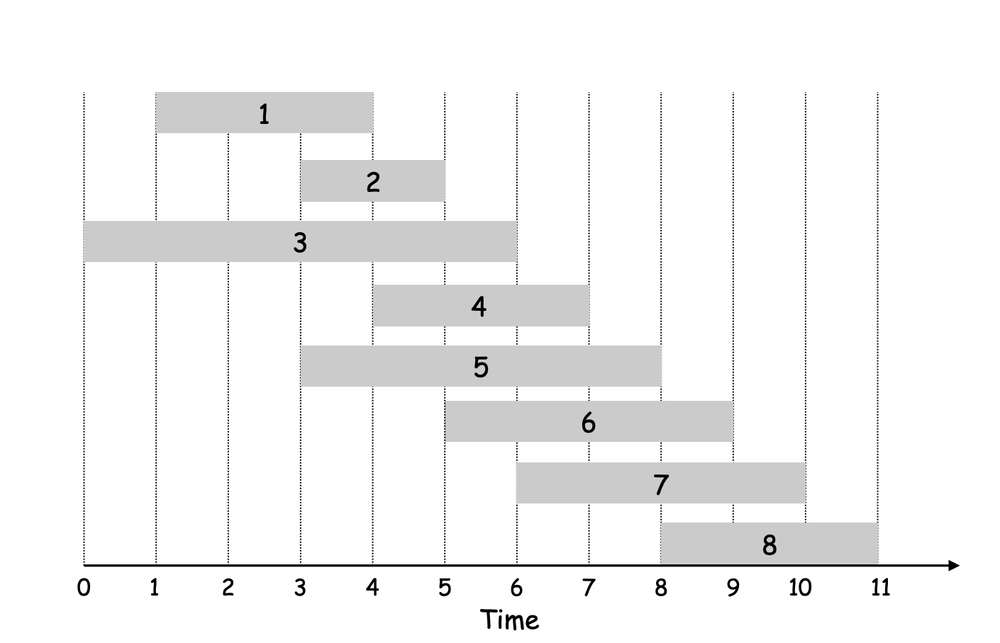
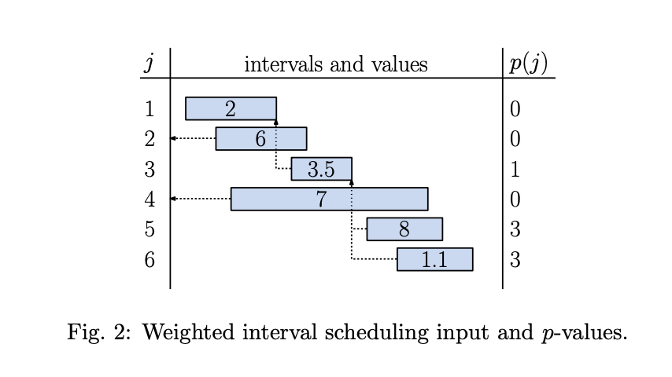

## Resources

https://www.cs.umd.edu/class/fall2017/cmsc451-0101/Lects/lect10-dp-intv-sched.pdf
https://courses.cs.washington.edu/courses/cse521/13wi/slides/06dp-sched.pdf
https://leetcode.com/problems/maximum-profit-in-job-scheduling/

## Goal

Find maximum weight subset of mutually compatible jobs

## Input

N,
start times per job/interval: `s[]`
finish times per job/interval: `f[]`
value/weight per job/interval: `w[]`

## Sort by finish times

Sort the jobs by finish times.

## Aux datastructure for prev interval compatibility query: `prev[]`

```
prev[0] = - (no jobs)
prev[j] = largest index i less than j, which is compatible with job/interval j  
```

Lets calculate for following:


| j | `prev[j]` |
| --- | --- |
| 0 | - |
| 1 | 0 |
| 2 | 0 |
| 3 | 0 |
| 4 | 1 |
| 5 | 0 |
| 6 | 2 |
| 7 | 3 |
| 8 | 5 |

Here is one more example:


## DP state

`dp[j] = max weight for all 1..j jobs considred`

## DP recurrence

### Base case

`dp[0] = 0` - no jobs, no weight.
`dp[1] = w[1]` - only the first job is there, take it.

### Recurrence Transition (binary choice)

As we select `j+1`th, we have two options:
1. pick `j+1`th job - remove all the intersecting jobs with it, add its weight to ans
2. not pick `j+1`th job - `dp[j]`

Recurrence is:
```
dp[j] = | 0, j=0
        |
        | max(dp[j-1], dp[prev[j]] + w[j])
```

## Code

```java
class IntervalPair {
    public int start;
    public int end;
    public int profit;
    
    IntervalPair(int s, int e, int p) {
        this.start = s;
        this.end = e;
        this.profit = p;
    }
}

class Solution {
    public int jobScheduling(int[] startTime, int[] endTime, int[] profit) {
        int N = startTime.length;
        int[] prev = new int[N];
        IntervalPair[] allIntervals = new IntervalPair[N];
        for(int i = 0; i< N; i++) {
            allIntervals[i] = new IntervalPair(startTime[i], endTime[i], profit[i]);
        }
        
        Arrays.sort(allIntervals, (o1,  o2) -> Integer.compare(o1.end, o2.end));
        computePrevCompatible(prev, allIntervals);
        // System.out.println(Arrays.toString(prev));
        
        int[] dp = new int[N];
        dp[0] = allIntervals[0].profit;
        for(int i=1;i<N;i++) {
            // either dont pick ith interval, or pick ith -> profit + get best soln of prev compatible intervals
            dp[i] = Math.max(dp[i-1], allIntervals[i].profit + ((prev[i] == -1) ? 0 : dp[prev[i]]));
        }
        
        return dp[N-1];
    }
    
    public void computePrevCompatible(int[] prev, IntervalPair[] allIntervals) {
        for(int i=0;i<prev.length;i++) {
            prev[i] = -1;// no compatible index
        }
        for(int i = 1; i < prev.length; i++) {
            for(int j = i-1; j >= 0; j--) {
                if(allIntervals[j].end <= allIntervals[i].start) {
                    prev[i] = j;
                    break;
                }
            }
        }
    }
}
```