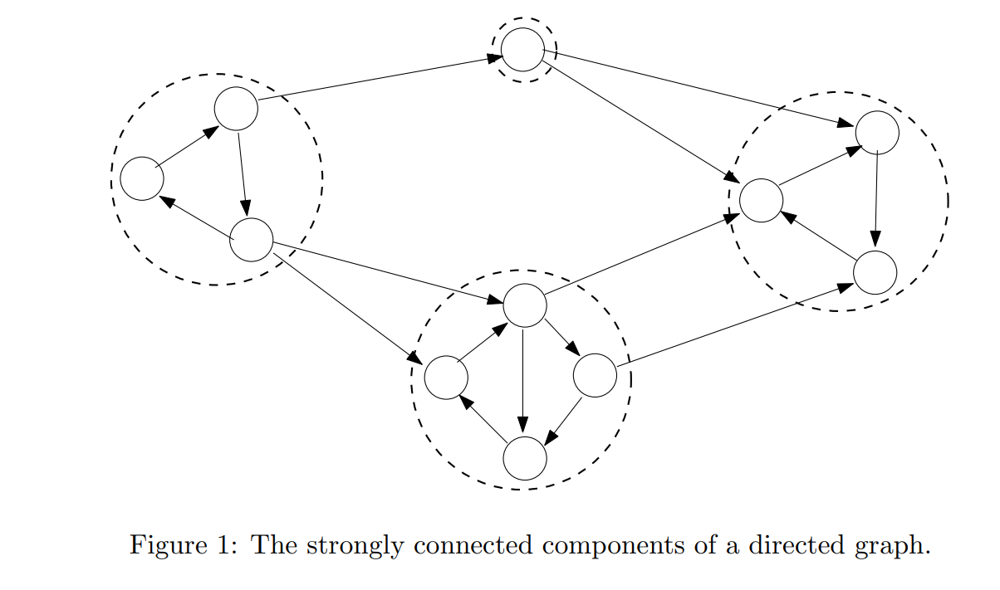

## REsources

https://web.stanford.edu/class/archive/cs/cs161/cs161.1138/lectures/03/Small03.pdf

https://www.topcoder.com/thrive/articles/kosarajus-algorithm-for-strongly-connected-components

## Strongly connected component

It is maximal subset of vertices C such that any two vertices of this subset are reachable from each other. 
i.e for any u,v in C: 
u -> v path exists, v -> u exists.

SCC partition a graph into disconnected partitions where each partition is a cycle.

## Condensation graph

Graph containing every strongly connected component as one vertex.

Each vertex of a condensation graph corresponds to a strongly connected component of original Graph G.

**Condensation graph will be acyclic, or in another words, SCCs of a graph form a DAG** - Proof by contradiction: if there was a cycle between two condensed vertices(i.e. components) A and B, it would be possible to  reach from any vertex inside A to any vertex inside B and they would not be two separate components. Hence Condensation graph must be acyclic.

Intuitively a two layer structure:
1. higher level a graph is a DAG between SCCs showing top level connections between cluster of nodes.
2. Lower level you see strong connections between nodes in the same component.

## Interesting properties of SCC

* Two SCCs C1 and C2 are either equal or distjoint.

* Every node belongs to exactly one SCC.

* SCCs of a graph form a partition of the nodes of a graph.

## DFS based linear time algorithms

### Kosaraju's algorithm

Two passes of DFS used.

### Tarjan's algorithm

Single DFS pass used.

