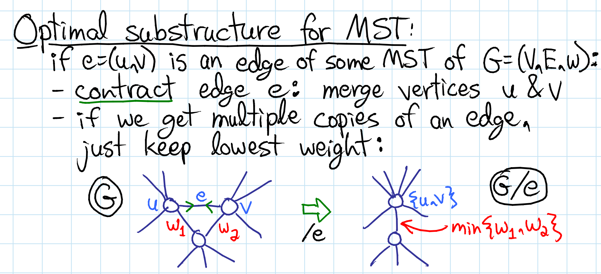

## Resources

https://ocw.mit.edu/courses/6-046j-design-and-analysis-of-algorithms-spring-2015/67e57b7bb3f1c85b3271937e3d355030_MIT6_046JS15_writtenlec12.pdf

https://ocw.mit.edu/courses/6-046j-design-and-analysis-of-algorithms-spring-2015/4a7fdddff3bc419c70bb470106a1663a_MIT6_046JS15_lec12.pdf

https://cp-algorithms.com/graph/mst_kruskal.html

https://cp-algorithms.com/graph/mst_prim.html

## Goal

Given **weighted undirected** graph,
find a subtree which covers all vertices i.e. vertex set is same, edge set is a subset of original graph, i.e. a spanning tree which has least total weight(of all the edges). The weight of the tree is defined as sum of weight of all the edges in that tree.

There can be many valid spanning trees and also many valid minimum spanning trees.

## How many spanning trees can be present in a graph?

Exponential

## Edge contraction Idea

When you merge two nodes of an edge i.e. `(u,v)` into a single node `uv`, it is known as `edge contraction`.

**Notation** - `G/e` means `G` where `e` is contracted. 

The neighbouring edges from uv will now be a union of 
neighbors of `u` and neighbours of `v`.

What if `u` and `v` have a common neighbour `w`, i.e `u<->w` and `v<->w`?
In case of MST, have `uv<->w` as the new edge and keep min weight of the two edges `u<->w` and `v<->w`.




## GReedy choice property

For any Cut `(S, V-S)` in Graph G = (V,E,w),
anly least-weight crossing edge in e = {u, v} with `u in S` & `v not in S`, this edge {u, v} is in some MST of G.


Proof idea:
We have a min-weight edge `e` between Cut (S,V-S), that connects `u-v`, where `u in S, v in V-S`.
Picking min weight edge between Cuts i.e (S,V-S), always helps and never harms, also if there was another 
path/edge e' from `u<->v` that goes via the Cut (S,V-S), it would not be picked because, we already have a better choice `e` to bridge the Cut (S,V-S).

## Useful properties

* If all edge weights are distinct, there is a unique minimum spanning tree.

* MST is also the tree with min product of weights of edges(proved by replacing weights of all edges with their logarithms)


## Kruskal's algorithm (with Edge list + UFDS for cycle check)

* Sort Edges `e` based on their increasing weight (edge list DS instead )
* Greedily try to add edges into The MST so that they do not form a cycle.
* cycle check can be done via UFDS
* Conceptually forests  of small trees gradually merging into MST.


## Prim's algorithm (With Adjacency List representation)

### Extra data structures needed
* A min heap/min priority queue for edge/vertex selection of `<weight, vertexid>`
* A visited/seen vector so that we can avoid cycles


* We take a `starting vertex` 0
* A `priority queue` for node weights and edge selection.
* `Greedily select pair` in front of priority Queue that does not form a cycle
* Conceptually grow MST from single souce, till it spans entire graph.


Initial weights for all other vertices except the start is infinity (They are updated via edges that come from the cut).

**We maintain vertex<->weights mapping(Which are updated by discovering edges and their edge weights).**

* All processed nodes are kept track via a set S (representing source Set).
* select a vertex in (V-S) by inspecting all outgoing edges from the Cut S -> V-S, pick vertex which has min weight.
* From the selected vertex, Relax neighbour vertex weights via edges (decrease-key on vertex, indexedPQ, where index is vertex)
* Loop

### Prims implementation issues (cpp)

STL containers like `priority_queue` do not have `decrease_key` operation needed by prim's and djikstra's algorithm.

https://stackoverflow.com/questions/9209323/easiest-way-of-using-min-priority-queue-with-key-update-in-c
https://stackoverflow.com/questions/19990520/augmenting-index-priority-queue-in-stl
The `std::priority_queue<T>` doesn't support efficient look-up of nodes: it uses a d-ary heap, typically with `d == 2`. This representation doesn't keep nodes put. If you really want to use a `std::priority_queue<T>` with Prim's algorithm, the only way is to just add nodes with their current shortest distance and possibly add each node multiple times. This turns the size of the into O(E) instead of O(N), though, i.e., for graphs with many edges it will result in a much higher complexity.


### Sample cpp implementation

`Process step Idea`: 
1. set `u` as taken
2. push its non-taken neighbors on priority queue.
```cpp
void process(int u) {// set u as taken, and push non-taken neighbors on pq.

}
```

`Main loop`:


