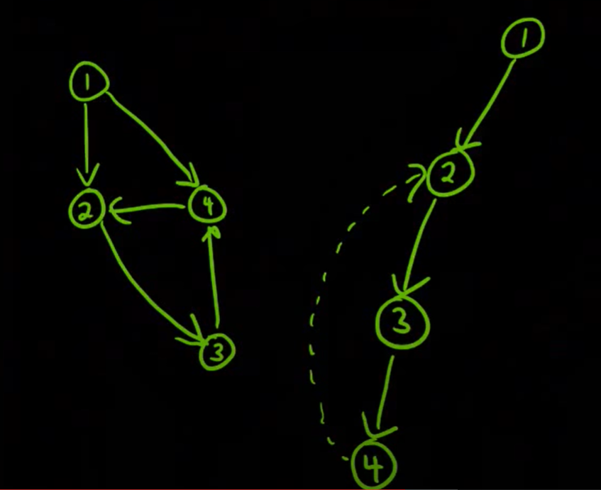

## Implicit graph

Figure out the vertex set and edge set yourself.
E.g. in a 2-d grid, cells are vertices and connection to the the 8 neighbouring cells would form edges.

## representations

Note in each representation, getting a vertex adj list is constant time.
i.e. indexing into a given vertex info is constant time.
iterating through the edges of a given vertex-id is linear in the number of edges.


### 2-d array Representation

* VxV 2d array (static in java/c++)
* numerical ids for vertices
Good for highly connected graph (V * V is max possible edges)
```js
[ // connections are 1, nno connections are 0
    0: [0,1,1,0,0,0],
    1: [0,0,0,1,0,0],
    2: [0,0,0,0,1,0],
    3: [0,0,0,0,0,0],
    4: [0,1,0,0,0,0],
    5: [0,0,0,1,0,0]
]
```

### Adjacency list representation (vertex are index of array)

* Numerical ids for vertices
* Array of lists/arrays(dynamic).e.g. array of arraylists in java and array of vectors in c++.
* each index of array holds a reference to a adjancency list of that vertex
e.g.
```js
[
    0: [1,2],
    1: [3],
    2: [4],
    3: [],
    4: [1],
    5: [3]
]
```

### Adjancency list: vertex are hashmap keys, values are list of adjacent vertices (most common along with list of lists shown above)

```js
{
    a: ['b', 'c'],
    b: ['d']
    c: ['e']
    d: []
    e: ['b'],
    f: ['d']
}
```
In c++, java it can be a Map where keys can be either int or string vertex-ids, and values would be a (dynamic)list of adjacent vertex-ids.

## Terminologies

### Articulation Point
A vertex in graph G, whose removal(including removing all edges it has), disconnects G.

### Bridge

An edge in (undirected?) graph G whose removal (keeping all vertices as it is), removal of this edge disconnects G.

* An edge is a bridge if and only if it is not contained in any cycle.
* In a tree, every edge is a bridge because a tree has no cycles.

## Transpose of a graph

Transpose of a directed graph G is another directed graph on the same set of vertices with `all of the edges reversed`.

## A simple test directed graph



A nice directed test graph is following:
```
1 -> 2
2 -> 3
3 -> 4
4 -> 2
1 -> 4
```

It has three tree edges: `1->2, 2->3, 3->4`,
It has one back edge: `4 -> 2`
and one forward edge: `1 -> 4`

## Edge contraction

When you merge two nodes of an edge i.e. (u,v) into a single node uv, it is known as edge contraction.

The neighbouring edges from uv will now be a union of 
neighbors of `u` and neighbours of `v`.

What if `u` and `v` have a common neighbour `w`, i.e `u<->w` and `v<->w`?
In case of MST, have `uv<->w` as the new edge and keep min weight of the two edges `u<->w` and `v<->w`.


